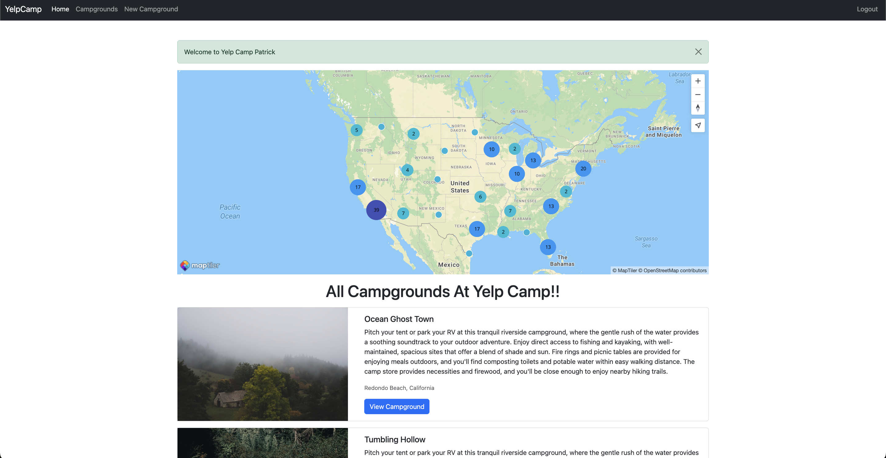
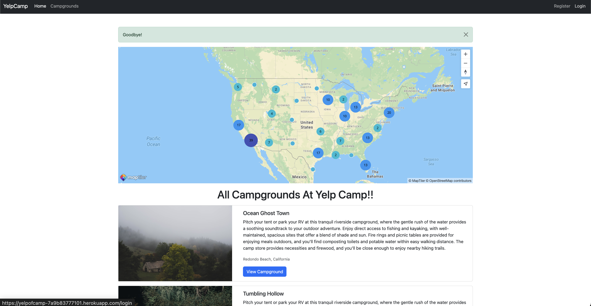
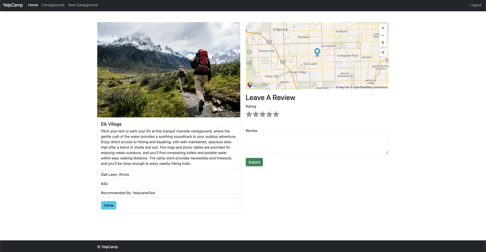
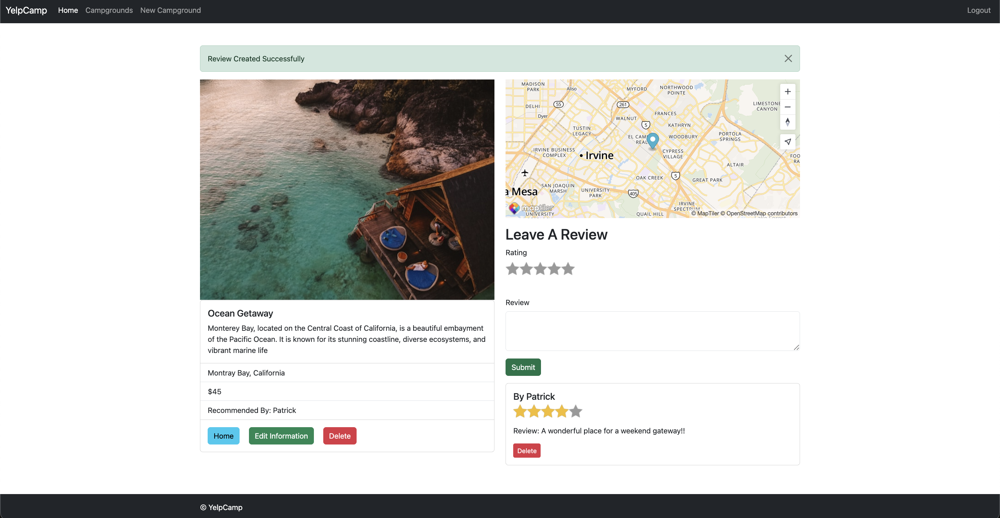
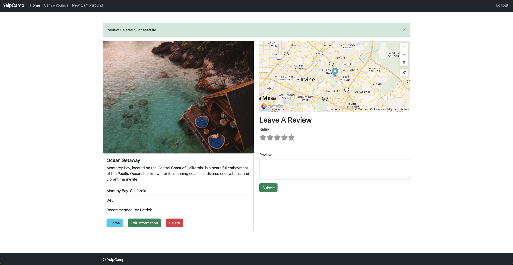
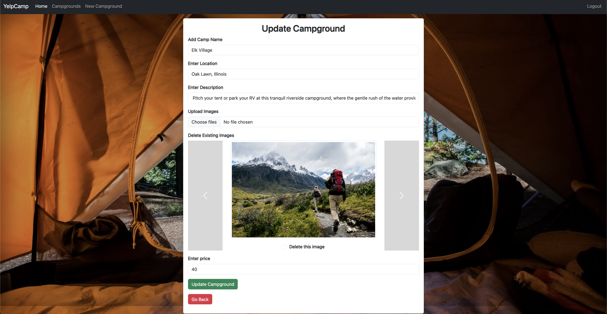

# YelpCamp

YelpCamp is a full-stack web application that allows users to discover, create, review, and manage campgrounds. It features secure user authentication, dynamic image uploads with Cloudinary, and interactive maps with MapTiler. Deployed on Heroku with a MongoDB Atlas backend.

---

## Live Demo

[https://yelpofcamp-7a9b83777101.herokuapp.com](https://yelpofcamp-7a9b83777101.herokuapp.com)

---

## Screenshots

### Register / Login / Logout

#### Register

**Step 2: Successful Registration**


#### Login

**Step 1: Login Form**


**Step 2: Login Failure Example**


**Step 3: Successful Login**


#### Logout


---

## Features

### 1. User Authentication

- Register, login, and logout securely using **Passport.js** (LocalStrategy).
- Session management is handled using `express-session`, with session data stored in **MongoDB** via `connect-mongo` — ensuring persistent and scalable session storage across server restarts and deployments.
  
---

### 2. Campground CRUD (Create, Read, Update, Delete)

- Logged-in users can:
  - **Create** a new campground (title, location, price, images, description)
  - **View** all campgrounds
  - **Edit or Delete** only their own campgrounds

#### Create Campground


#### Campground Detail


---

### 3. Review System

- Users can:
  - **Add reviews** with comments and ratings
  - **Delete only their own reviews**

#### Add Review


#### Delete Review
Only review owners can delete:


---

### 4. Update Campground Information & Images

- Owners can:
  - **Edit campground details**
  - **Upload new images** (via Multer + Cloudinary)
  - **Delete old images** (from both Cloudinary and DB)

#### Edit Form to Add New Images, Delete Existing Images and update campground information


---

### Access Control

| Action                      | Requires Login | Must Be Owner |
|-----------------------------|----------------|---------------|
| Create campground           | ✅              | ❌            |
| Edit/Delete campground      | ✅              | ✅            |
| Add review                  | ✅              | ❌            |
| Delete review               | ✅              | ✅            |
| Upload/Delete images        | ✅              | ✅            |

Middleware like `isLoggedIn`, `isAuthor`, and `isReviewAuthor` enforce these rules.

---

## Tech Stack

| Tool/Service     | Purpose                                |
|------------------|----------------------------------------|
| Node.js          | Backend runtime                        |
| Express.js       | Web framework                          |
| MongoDB Atlas    | NoSQL cloud database                   |
| Mongoose         | ODM for MongoDB                        |
| EJS              | Templating engine                      |
| Bootstrap        | Frontend styling                       |
| Cloudinary       | Image storage and deletion             |
| Multer           | File upload middleware                 |
| MapTiler         | Interactive campground maps            |
| Passport.js      | Authentication                         |
| dotenv           | Environment variable management        |
| Heroku           | Deployment                             |

---

## Hosting and Integrations

- **Heroku** hosts the backend and serves the frontend.
- **MongoDB Atlas** stores user data, reviews, and campground info.
- **Cloudinary** handles all campground image uploads and deletions.
- **MapTiler** renders maps based on campground location.

---

## Environment Variables

Set in a `.env` file (not committed to version control):

```env
CLOUDINARY_CLOUD_NAME=your_cloud_name
CLOUDINARY_KEY=your_api_key
CLOUDINARY_SECRET=your_secret
MAPTILER_KEY=your_maptiler_api_key
DB_URL=your_mongo_atlas_uri
SECRET=your_session_secret
